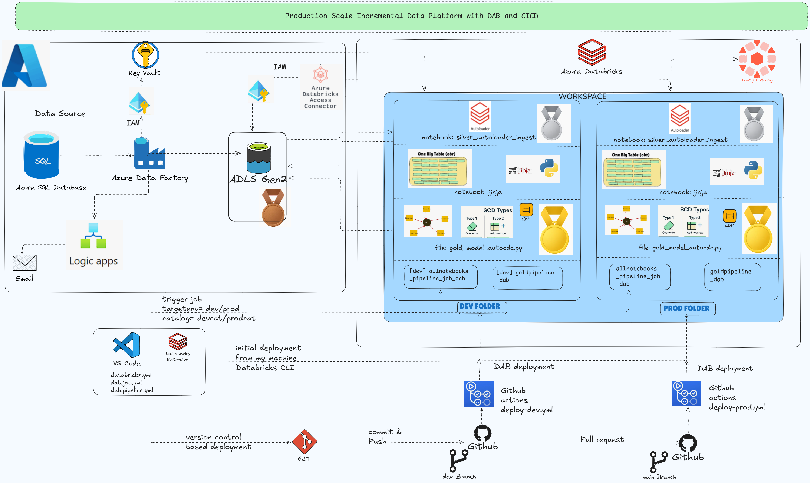

# Production-Scale-Incremental-Data-Platform-with-DAB-and-CICD

## 📌 Architecture Overview
This repository contains the complete implementation of a production-grade, end-to-end data platform built with modern cloud-native DevOps principles. The core objective of this project is to showcase **environment-decoupled parameterization**—enabling a single, dynamic codebase to orchestrate and process data safely across isolated **Development (Dev)** and **Production (Prod)** targets without code duplication or hardcoded parameters.

### 📐 System Architecture Diagram

